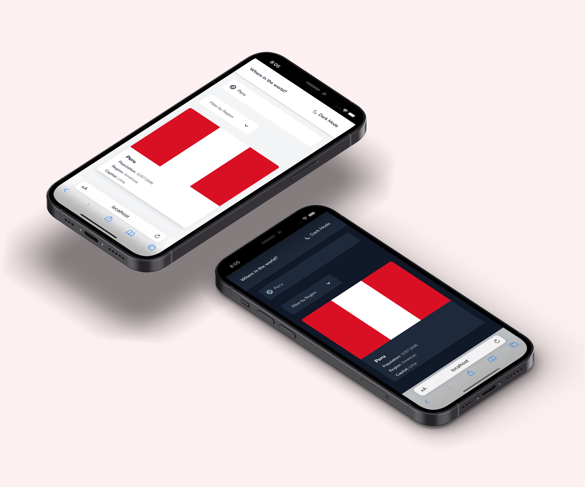
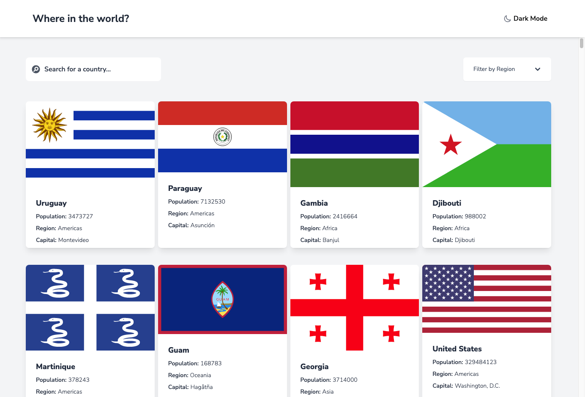
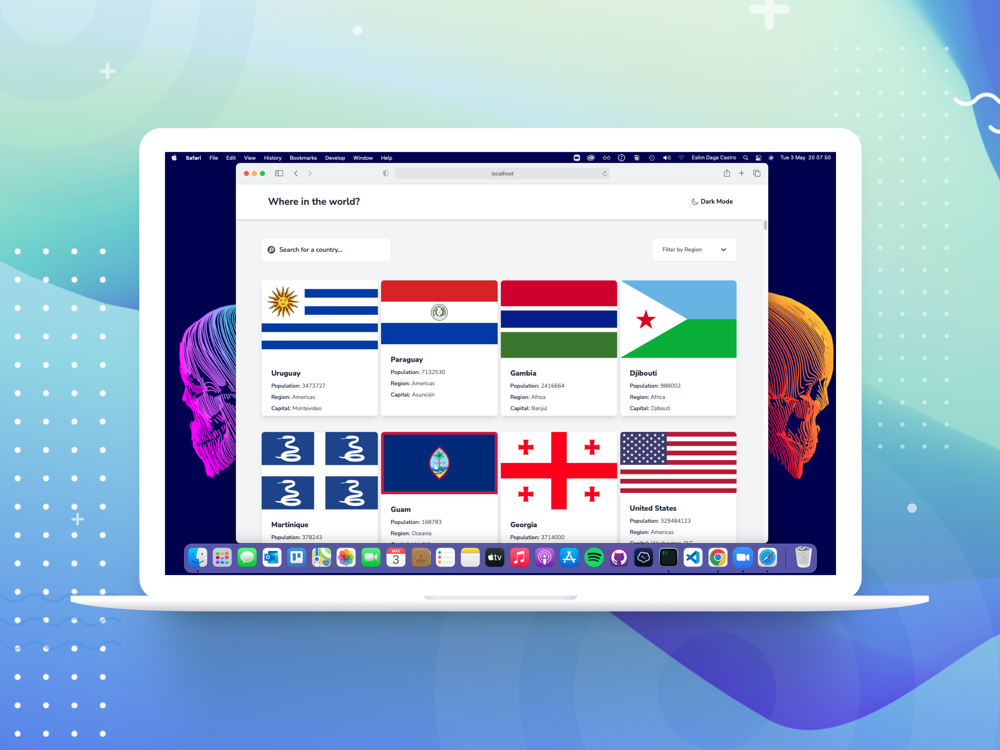
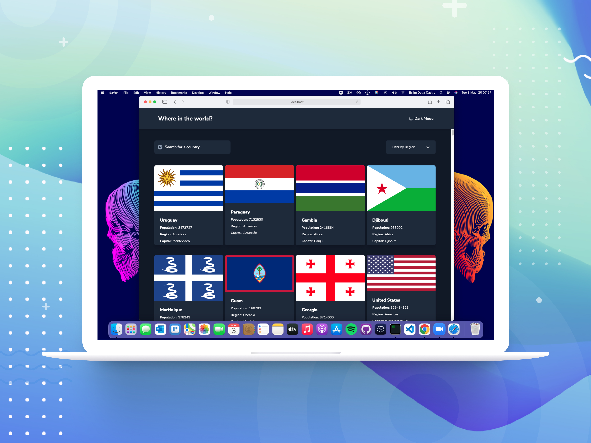

# Frontend Mentor - REST Countries API with color theme switcher solution

This is a solution to the [GitHub user search app challenge on Frontend Mentor](https://www.frontendmentor.io/challenges/rest-countries-api-with-color-theme-switcher-5cacc469fec04111f7b848ca). Frontend Mentor challenges help you improve your coding skills by building realistic projects.

## Installation and Setup Instructions 💻

Clone down this repository. You will need `node` and `npm` installed globally on your machine.

Installation:

`npm install`

To Start Server:

`npm start`

To Visit App:

`localhost:3000`

## Table of contents 📄

- [Frontend Mentor - GitHub user search app solution](#frontend-mentor---github-user-search-app-solution)
  - [Installation](#installation-and-setup-instructions)
  - [Table of contents](#table-of-contents)
  - [Overview](#overview)
    - [The challenge](#the-challenge)
    - [Screenshot](#screenshot)
    - [Links](#links)
  - [My process](#my-process)
    - [Built with](#built-with)
  - [Author](#author)

## Overview 🧩

### The challenge

Users should be able to:

- See all countries from the API on the homepage.
- Search for a country using an input field.
- Filter countries by region.
- Click on a country to see more detailed information on a separate page.
- Click through to the border countries on the detail page.
- Toggle the color scheme between light and dark mode (optional).

### Screenshot

### Links 🔗

- Solution URL: [https://github.com/EslimDaga/react-country-app](https://github.com/EslimDaga/react-country-app)
- Live Site URL: [https://react-country-app-vercel.vercel.app/](https://react-country-app-vercel.vercel.app/)

## My process 📄

### Built with

- [React](https://reactjs.org/) - JS library
- [Tailwind ](https://tailwindcss.com/) - CSS framework

### Deploy with
- [Vercel](https://vercel.com/)

## Author 👨🏻‍💻

- Frontend Mentor - [@eslimdaga](https://www.frontendmentor.io/profile/eslimdaga)
- Twitter - [@eslimdaga](https://www.twitter.com/eslimdaga)